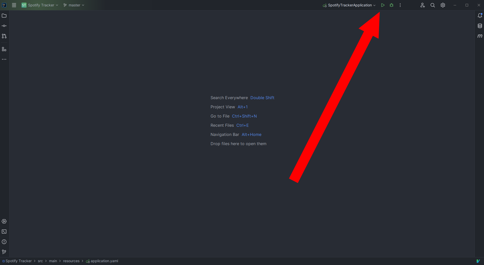

# Spotify Tracker

Spotify Tracker is a Java Spring Boot project that makes use of Spotify API to display if any of your followed artists has uploaded a new song or album


## Installation

#### Create Spotify application in Spotify Dashboard. 
Head to https://developer.spotify.com/, log in with your Spotify account and create a new application. Add http://localhost:8080/login/oauth2/code/spotify as redirect uri.

<p align="center">
  
<br><br>
  
<br><br>
  
</p>

#### Clone this repo
```bash
  git clone https://github.com/Namlev1/spotify_tracker.git
  cd spotify_tracker
```

#### Pass client id and secret to src/main/resources/application.yaml

<p align="center">
  
<br><br>
  
</p>

#### Install and run
<ins>Using maven:</ins>

```bash
    mvn spring-boot:run
```

This will download all the dependencies and after that run the application.

<ins>Using IntelliJ Idea:</ins>

Open the project with IntelliJ Idea, wait until all the dependencies are downloaded and press *run*:

<p align="center">
  
</p>

## Usage

The server runs on http://localhost:8080. On first visit, user will be prompted to log in with his Spotify account. After that, the user can enter http://localhost:8080/releases endpoint, which (after a while) will present the result of API OAuth2 calls.

<p align="center">
  
</p>


## Tech Stack

Java 17, Spring Boot 3, Spring Security 6, JUnit 5

JPA, Hibernate, H2 database

Thymeleaf, Jackson, OAuth2

## FAQ

#### How is data persisted?

All the data is stored in H2 database. User can access it at localhost:8080/h2-console, with url *jdbc:h2:mem:testdb*, username *sa* and no password (login credentials can be easily changed in **application.yaml** file)

#### How is all the data collected?

When user logs in, it begins background process that creates API requests. Firstly the application collect information about all the followed artists, and afterwards information about their releases. Then it decides, if songs/albums are appropriate to display.

However, since this process can take a long time, when a user is already registered in the database, the process of collecting data does not begin on the login, but instead every day at 1 a.m. automatically.
